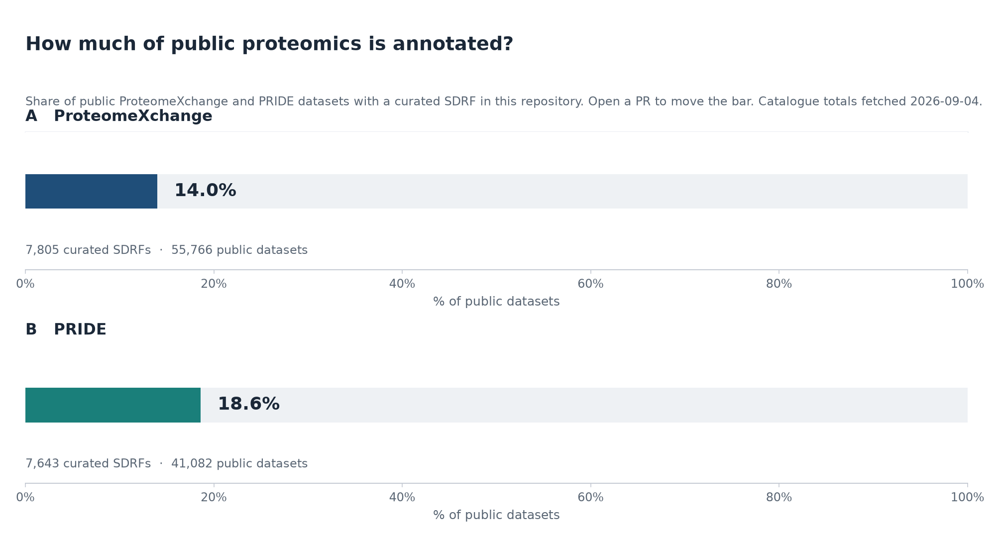
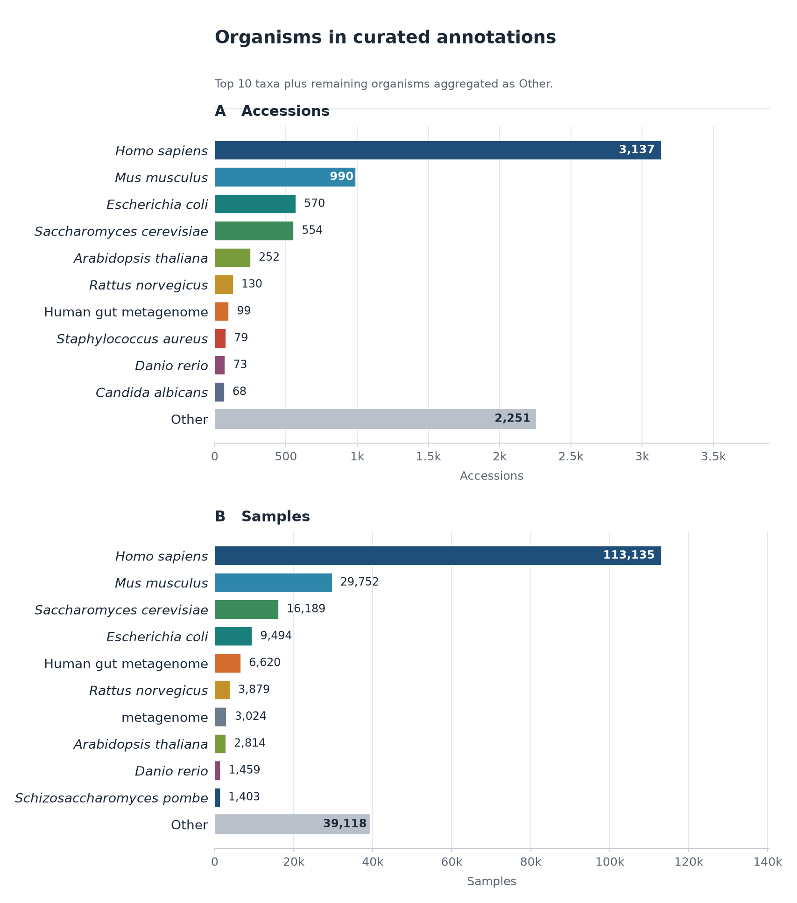
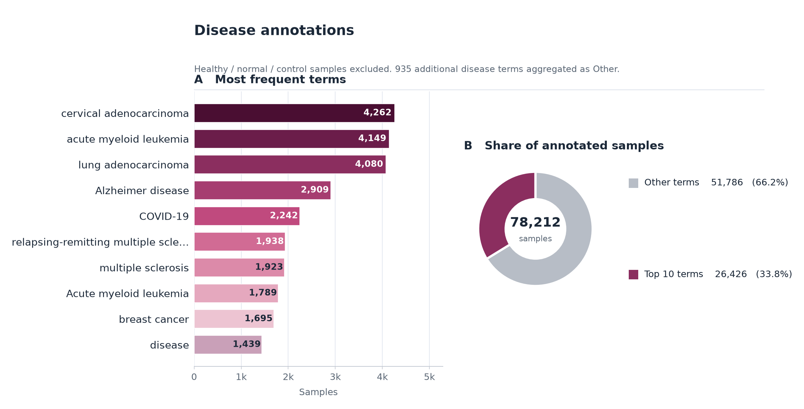
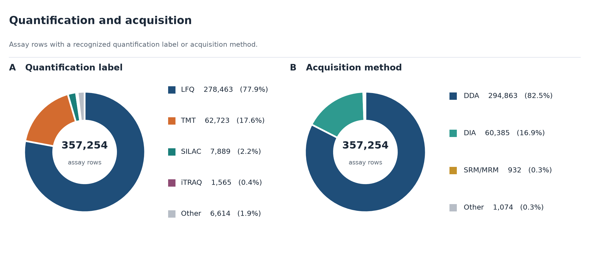
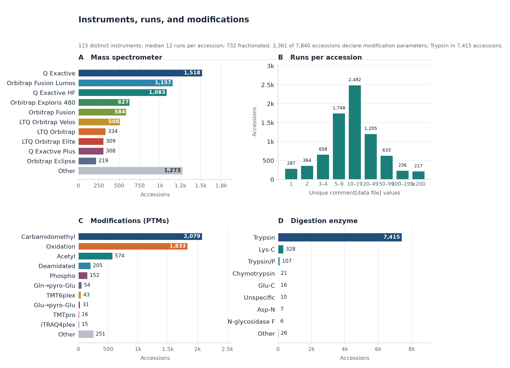
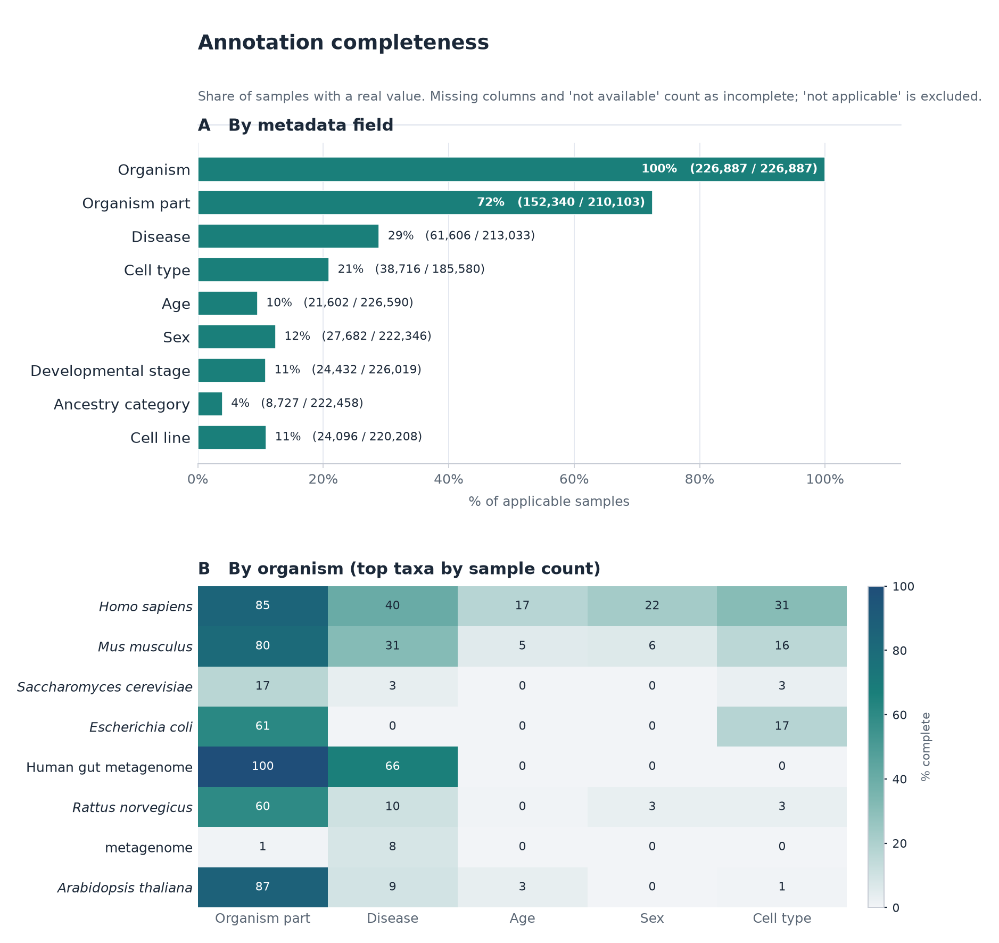
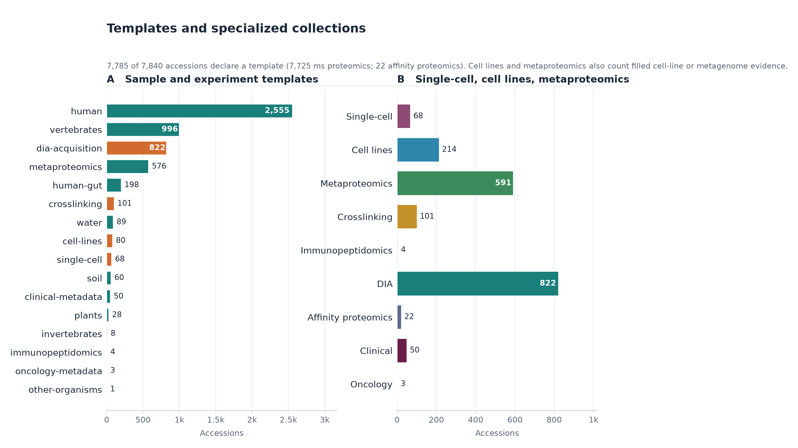
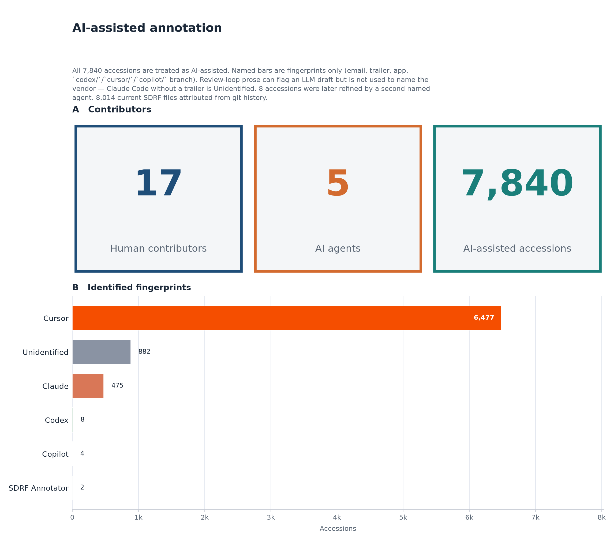

# sdrf-annotated-datasets

[](LICENSE)
[](llms.txt)


[](https://github.com/bigbio/sdrf-annotated-datasets/actions/workflows/validate-sdrf.yml)

Community **SDRF** annotations for public proteomics datasets (ProteomeXchange and related accessions).
The SDRF specification lives in [`bigbio/proteomics-sample-metadata`](https://github.com/bigbio/proteomics-sample-metadata).

**License:** [Apache 2.0](LICENSE) · **Contributing:** [CONTRIBUTING.md](CONTRIBUTING.md) · **Agent context:** [llms.txt](llms.txt), [AGENTS.md](AGENTS.md)

<!-- STATS:START -->
## Resource at a glance

_Auto-generated from curated `datasets/` on 2026-09-04T11:45:56Z. Sandbox drafts are excluded._

| Metric | Count |
| --- | ---: |
| Accessions | 7,840 |
| SDRF files | 8,014 |
| Accessions with a declared template | 7,785 |
| Samples (unique `source name` per file) | 226,998 |
| Runs (unique `comment[data file]` per file) | 293,643 |
| Assay rows | 367,356 |
| Human contributors | 17 |
| AI agents (named fingerprints) | 5 |
| AI-assisted accessions | 7,840 |
| Unidentified agent | 882 |
| Multi-agent accessions | 8 |
| Distinct instruments | 115 |
| Median runs per accession | 12 |
| Accessions with modification parameters | 2,361 |
| ProteomeXchange coverage | 7,805 / 55,766 (14.0%) |
| PRIDE coverage | 7,643 / 41,082 (18.6%) |

**Highlights:** most common organism is **Homo sapiens**; **60,385** DIA assay rows; **62,723** TMT and **278,463** LFQ assay rows; **68** single-cell, **214** cell-line, and **591** metaproteomics accessions; sample-field completeness (applicable samples): disease 29%, age 10%; all **7,840** accessions are AI-assisted (**17** human contributors, **5** named AI agents); identified fingerprints are mostly **Cursor**; **882** accessions have no vendor fingerprint (typical of Claude Code committed as the reviewer); **8** accessions have Codex evidence (`codex/` PR branches); **8** accessions were touched by more than one agent (most common handoff **Cursor → Claude**); most common instrument is **Q Exactive**; most common modification is **Carbamidomethyl**; **14.0%** of public ProteomeXchange datasets have a curated SDRF here; **18.6%** of PRIDE projects are annotated.

















<!-- STATS:END -->

## Key links

| Resource | URL |
|---|---|
| Specification | https://github.com/bigbio/proteomics-sample-metadata/blob/master/sdrf-proteomics/README.adoc |
| Public site | https://sdrf.quantms.org/ |
| Templates | https://github.com/bigbio/sdrf-templates |
| Validator CLI (`parse_sdrf`) | https://github.com/bigbio/sdrf-pipelines |
| Agentic toolkit | https://github.com/bigbio/sdrf-skills |

## Dataset layout

Files follow the pattern `datasets/{ACCESSION}/{ACCESSION}.sdrf.tsv`:

```
datasets/PXD000070/PXD000070.sdrf.tsv
datasets/MSV000078494/MSV000078494.sdrf.tsv
```

Additional `.sdrf.tsv` files may appear in the same folder when a project requires split designs.

## Sandbox

Work-in-progress annotations live under [`sandbox/`](sandbox/README.md).
Move a folder to `datasets/` and open a PR once it passes `parse_sdrf validate-sdrf`.
CI only validates `datasets/`; `sandbox/` is exempt so drafts don't block merges.

## Contributing

Open a pull request to add or improve annotated SDRF files.
See [CONTRIBUTING.md](CONTRIBUTING.md) for layout rules and review etiquette.

### Agent-assisted annotation

Use **[sdrf-skills](https://github.com/bigbio/sdrf-skills)** as the primary toolkit.
Key rules:

- **Anchor every row** in public evidence (PX page, submitted metadata, publication). Don't invent sample names or file names.
- **Keep PRs small** — one accession or a closely related batch.
- **Run validation locally** (`parse_sdrf validate-sdrf`) before opening a PR.
- **Declare assistance** in the PR description so reviewers can calibrate review depth.

For agent-specific instructions see [AGENTS.md](AGENTS.md).

### CI validation

GitHub Actions runs `parse_sdrf validate-sdrf` on every PR and push touching `datasets/**`.
The validator is installed from [`bigbio/sdrf-pipelines`](https://github.com/bigbio/sdrf-pipelines) `main` branch.
Re-run all checks manually via `workflow_dispatch` in the Actions tab.

## How to cite

- Dai C, Füllgrabe A, Pfeuffer J, Solovyeva EM, Deng J, Moreno P, Kamatchinathan S, Kundu DJ, George N, Fexova S, Grüning B, Föll MC, Griss J, Vaudel M, Audain E, Locard-Paulet M, Turewicz M, Eisenacher M, Uszkoreit J, Van Den Bossche T, Schwämmle V, Webel H, Schulze S, Bouyssié D, Jayaram S, Duggineni VK, Samaras P, Wilhelm M, Choi M, Wang M, Kohlbacher O, Brazma A, Papatheodorou I, Bandeira N, Deutsch EW, Vizcaíno JA, Bai M, Sachsenberg T, Levitsky LI, Perez-Riverol Y. A proteomics sample metadata representation for multiomics integration and big data analysis. Nat Commun. 2021 Oct 6;12(1):5854. doi: 10.1038/s41467-021-26111-3. PMID: 34615866; PMCID: PMC8494749. [Manuscript](https://www.nature.com/articles/s41467-021-26111-3)
- Perez-Riverol, Yasset, European Bioinformatics Community for Mass Spectrometry. "Towards a sample metadata standard in public proteomics repositories." Journal of Proteome Research (2020) [Manuscript](https://pubs.acs.org/doi/abs/10.1021/acs.jproteome.0c00376).
